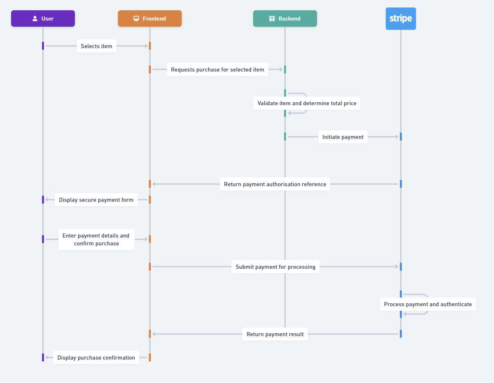
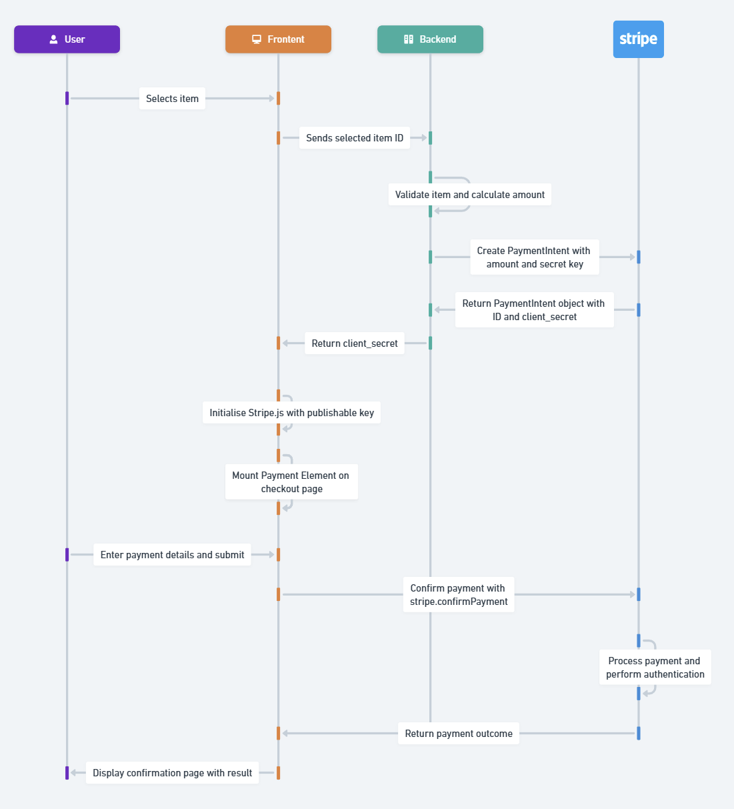

# Daniel's Take home project
This project completes the payment functionality for an existing e-commerce application. The original application already allowed users to browse and select books, but did not support payments.
My task was to integrate Stripe so that users can securely complete a purchase using Stripe Elements (Payment Element) and view a confirmation containing the total amount paid and the Stripe PaymentIntent ID.

## How to build, configure and run the application
To get started, clone the repository and run `npm install` to install dependencies:

```
git clone https://github.com/dvenneri/sa-takehome-project-node-submit.git
npm install
```
Rename `sample.env` to `.env` and populate with your Stripe account's test API keys

Then run the application locally:

```
npm start
```

Navigate to [http://localhost:3000](http://localhost:3000) to view the index page.

## How to Use the Application

1. On the homepage, select a product by clicking the “Purchase” button.
2. When the payment form is displayed, enter the following Stripe test card details:
    - Card number: 4242 4242 4242 4242
    - Expiry date: Any future date (e.g. 12/28)
    - CVC: Any three digits (e.g. 123)
3. Click “Pay” to submit the payment.
4. After the payment is processed, you will be shown a confirmation page displaying:
    The total amount charged
    The Stripe PaymentIntent ID (beginning with pi_)

If you would like to test declined payments, authentication challenges (such as 3D Secure), or other failure scenarios, Stripe provides a comprehensive list of test card numbers and behaviours in their documentation: https://stripe.com/docs/testing

## Stripe APIs Used

The solution uses the following Stripe APIs and components:

- PaymentIntents - 
Used on the backend to create and manage the lifecycle of a payment. PaymentIntents handle authorisation, authentication, and final payment state in a single, consistent model.

- Stripe.js - 
Loaded in the browser using the publishable key. Stripe.js allows the frontend to interact securely with Stripe without exposing the secret key.

- Stripe Elements (Payment Element) - 
A prebuilt, Stripe-hosted UI component used to collect payment details. The Payment Element automatically supports multiple payment methods and authentication flows.

- Payment Confirmation (confirmPayment) - 
Used on the frontend to submit the payment details collected by the Payment Element and complete the payment against the server-created PaymentIntent.

## Application Architecture

### Business Architecture
The diagram below illustrates the payment flow from a business perspective, focusing on user interaction, backend responsibilities, and the role of the payment provider.



### Technical Architecture
The following diagram shows the technical implementation of the payment flow and how the frontend, backend, and Stripe APIs interact during checkout.



## My Approach
The primary goal of this solution was to highlight Stripe’s ability to significantly reduce the complexity of facilitating payments, while still supporting robust, real-world payment flows.
The implementation intentionally keeps the application logic minimal and relies as closely as possible on Stripe’s official Payments Quickstart: https://docs.stripe.com/payments/quickstart

Specifically, the solution:
    
- Delegates payment security and authentication entirely to Stripe
- Uses PaymentIntents to manage the full payment lifecycle server-side
- Uses Stripe.js and the Payment Element to securely collect and confirm payments in the browser
- Avoids handling raw card data or implementing custom payment flows

The code is intentionally straightforward and closely aligned with Stripe’s documentation so that the payment flow is easy to follow, explain, and extend. This keeps the focus on payments architecture and responsibility boundaries, rather than on custom frontend or backend engineering.

## Challenges Encountered
The main challenge in this exercise was working through the application code and syntax, rather than understanding the payment concepts themselves. I was comfortable with the payments side of things, but translating that understanding into a working Node.js implementation required learning how the pieces fit together in code.

To help with this, I leveraged a combination of AI tools and Stripes Payments Quickstart guide to assist with JavaScript and Node.js syntax, as well as understanding where specific code blocks from Stripe’s documentation needed to live within the application. Importantly, AI was used as a learning aid, not a shortcut. Throughout the process, I focused on understanding what each piece of code was doing, why it was required, and how it mapped back to Stripe’s recommended payment flow. The Stripe documentation, especially the Payments Quickstart, was used as the primary source of truth to validate that the implementation followed supported patterns.

In contrast, understanding the payment lifecycle and behaviour such as when authentication is required, how failures are surfaced, and why PaymentIntents and client_secrets are used was more intuitive, given my prior experience working with payment systems. The bigger challenge was correctly expressing that flow in code and ensuring it was implemented in the right place within the application.

## Potential Extensions
If this application were extended into a more robust solution, my primary focus would be on enhancing the payment experience and making better use of Stripe’s platform capabilities. Some natural next steps would include:

- Redirect type payment methods such as Afterpay/Clearpay always return the customer to the configured return_url, regardless of whether the payment succeeds or fails. In a production implementation, the confirmation page would handle non-successful payments better and provide clearer recovery paths, such as retrying payment or returning the customer to checkout.

- I would consider using Stripe Checkout instead of the Payment Element for more advanced commerce needs. This would allow Stripe to handle things like GST calculation, shipping costs, address collection, and discounts.

- Send email receipts via Stripe. The application could collect the customer’s email address during checkout and pass it to Stripe. Stripe can then automatically send branded email receipts after successful payments, with branding managed directly in the Stripe Dashboard.

- Save payment details for future use. For repeat customers, payment details could be securely saved by creating a Stripe Customer allowing payment methods to be reused for future payments without the customer needing to re-enter their details.

- Improving how products and pricing are managed. The product list is currently hard-coded for simplicity. In a more realistic build, this would move to a proper source of truth:
  - a database table, so products and prices can be managed without code changes
  - Stripe Products and Prices, so pricing is centrally managed within Stripe

Overall, these extensions would continue the same approach shown in this project, with a focus on enhancing the payment experience while relying on Stripe to handle complexity behind the scenes.

